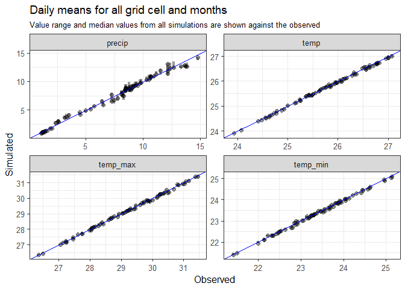
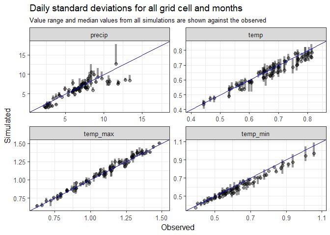
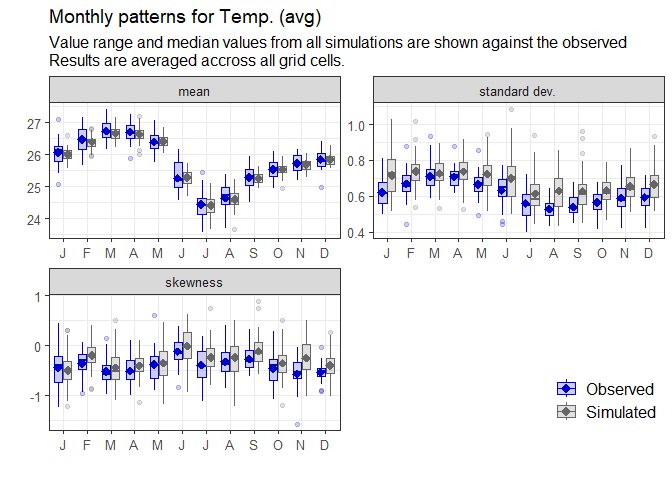
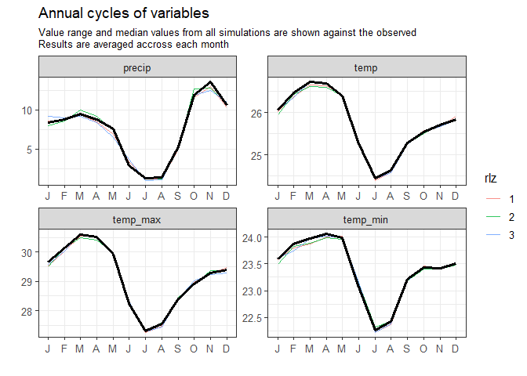
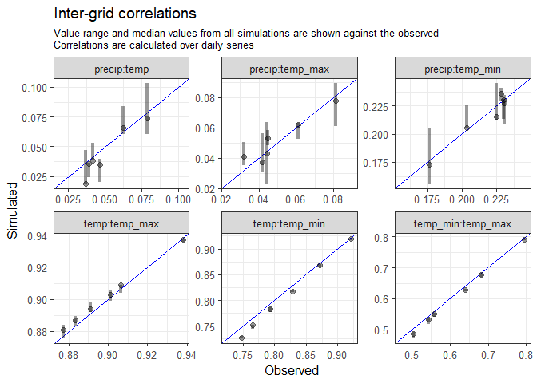
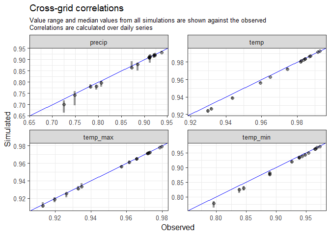
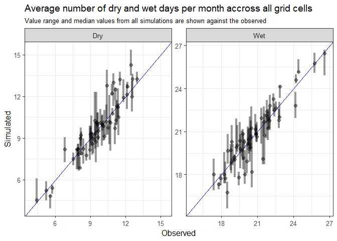

# Getting started


# Installation and setup

The latest version of the `weathergenr` package can be installed from
GitHub and then loaded into your R environment:

``` r
devtools::install_github("Deltares/weathergenr", upgrade = "never")
```

Once installed, load the relevant packages:

``` r
library(weathergenr)
library(dplyr)
library(ggplot2)
```

# :open_file_folder: Reading Gridded Multivariate Weather Data

For this exercise, we’ll use the ERA5 dataset (ECMWF Reanalysis v5)
included with the package, clipped over the Ntoum Basin in Gabon.


Use readNetcdf() to extract meteorological data from NetCDF files. It
wraps several ncdf4 functions and returns a structured object with:

- spatial coordinates
- dates
- grid info
- meteorological variables

``` r
ncfile <- system.file("extdata", "ntoum_era5_data.nc", package = "weathergenr")
ncdata <- readNetcdf(ncfile)
```

Inspect the structure:

``` r
names(ncdata)
```

    [1] "data"       "grid"       "date"       "dimensions" "attributes"

Each grid cell’s data is stored as a tidy data frame within the data
list:

``` r
ncdata$data[[1]]
```

    # A tibble: 7,671 × 7
       press_msl   kin temp_min temp_max  temp  kout precip
           <dbl> <dbl>    <dbl>    <dbl> <dbl> <dbl>  <dbl>
     1     1008.  174.     24.4     28.1  25.9  410.  9.12 
     2     1008.  162.     23.7     28.1  24.9  410. 15.6  
     3     1008.  201.     23.6     27.9  25.6  411.  4.84 
     4     1008.  177.     25.0     28.3  26.1  411.  5.20 
     5     1007.  218.     24.6     28.1  26.1  411.  1.54 
     6     1007.  199.     25.0     28.2  26.3  411.  8.35 
     7     1008.  195.     24.3     28.3  25.9  412. 14.4  
     8     1009.  158.     24.6     26.5  25.4  412. 11.4  
     9     1010.  143.     24.1     27.1  25.1  413.  9.15 
    10     1009.  220.     23.9     28.6  26.1  413.  0.810
    # ℹ 7,661 more rows

Grid metadata can be accessed through the grid element:

``` r
ncdata$grid
```

    # A tibble: 6 × 5
         id  xind  yind         x         y
      <int> <int> <dbl> <dbl[1d]> <dbl[1d]>
    1     1     1     1      9.5       0.5 
    2     2     2     1      9.75      0.5 
    3     3     3     1     10         0.5 
    4     4     1     2      9.5       0.25
    5     5     2     2      9.75      0.25
    6     6     3     2     10         0.25

Associated dates are accessed via the date element:

``` r
head(ncdata$date)
```

    [1] "2000-01-01" "2000-01-02" "2000-01-03" "2000-01-04" "2000-01-05"
    [6] "2000-01-06"

# :gear: Generate Stochastic Weather Realizations

We use generateWeatherSeries() to simulate new weather sequences from
historical record using a coupled a Wavelet Autoregressive Model (WARM)
with a a Markov Chain and KNN resampling scheme (See: [Steinscheineder
et al
(2013)](https://agupubs.onlinelibrary.wiley.com/doi/full/10.1002/wrcr.20528)

Define output path, variables, and simulation parameters.
**realization_num** parameters sets how many stochastic replicates will
be generated.

``` r
output_path <- tempdir()
variables <- c("precip", "temp", "temp_min", "temp_max")
variable_labels <- c("Precip.", "Temp. (avg)", "Temp. (min)", "Temp. (max)")
realization_num <- 3
```

Call the generator:

``` r
stochastic_weather <- generateWeatherSeries(
  weather.data = ncdata$data,
  weather.grid = ncdata$grid,
  weather.date = ncdata$date,
  variable.names = variables,
  variable.labels = variables,
  variable.units = NULL,
  sim.year.num = 20,
  sim.year.start = 2020,
  month.start = 1,
  realization.num = realization_num,
  warm.variable = "precip",
  warm.signif.level = 0.90,
  warm.sample.num = 10000,
  warm.subset.criteria = NULL,
  knn.sample.num = 100,
  mc.wet.quantile= 0.3,
  mc.extreme.quantile = 0.8,
  output.path = output_path,
  seed = 123)
```

Check resampled dates by the weather generator:

``` r
stochastic_weather$resampled
```

    # A tibble: 7,300 × 3
       rlz_1      rlz_2      rlz_3     
       <date>     <date>     <date>    
     1 2001-01-01 2001-01-01 2001-01-01
     2 2005-12-28 2012-01-05 2005-01-12
     3 2005-01-02 2012-01-05 2005-01-13
     4 2006-01-06 2012-01-05 2015-01-02
     5 2015-01-06 2012-01-05 2015-01-03
     6 2006-01-07 2012-01-05 2015-01-04
     7 2006-01-08 2012-01-06 2015-01-05
     8 2015-01-09 2002-01-09 2015-01-06
     9 2015-01-10 2014-01-10 2011-01-10
    10 2015-01-11 2014-01-11 2011-01-13
    # ℹ 7,290 more rows

# :mag: Evaluate Synthetic Series

Compare stochastic simulations against historical data using
**evaluateWegen** function:

``` r
day_order <- sapply(1:realization_num, 
                    function(n) match(stochastic_weather$resampled[[n]], ncdata$date))

rlz_sample <- list()
for (n in 1:realization_num) {
  rlz_sample[[n]] <- lapply(ncdata$data[ncdata$grid$id], function(x) x[day_order[,n],] %>%
                              select(precip,  temp, temp_min, temp_max) %>%
                              mutate(date = stochastic_weather$dates, .before = 1))
}

obs_sample <- lapply(ncdata$data[ncdata$grid$id], function(x) x %>%
                       select(precip, temp, temp_min, temp_max) %>%
                       dplyr::mutate(date = ncdata$date, .before = 1))

out <- evaluateWegen(daily.sim = rlz_sample,
              daily.obs = obs_sample,
              save.plots = FALSE,
              variables = variables,
              variable.labels = variable_labels,
              variable.units = NULL,
              realization.num = realization_num,
              wet.quantile = 0.3,
              extreme.quantile =0.8)
```

Daily statistics of all weather variables

``` r
out$daily_means
```



``` r
out$daily_sd
```



``` r
out$annual_pattern_precip
```


``` r
out$annual_pattern_temp
```



``` r
out$annual_pattern_precip
```


``` r
out$annual_pattern_temp
```


``` r
out$annual_cycle
```



``` r
out$intergrid_cor
```



``` r
out$crossgrid_cor
```



``` r
out$spell_lengths
```


``` r
out$spell_duration
```


